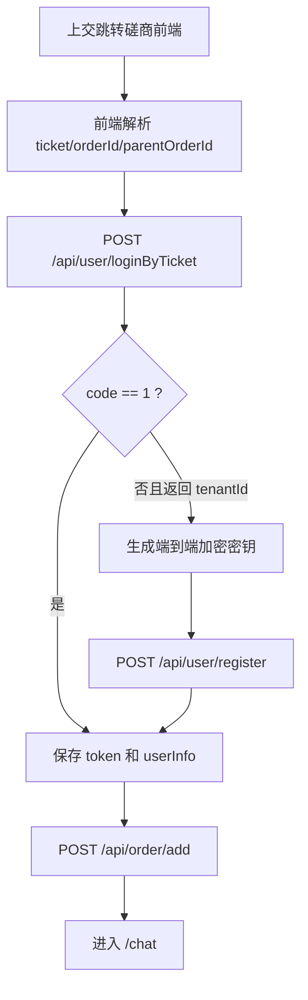

# 磋商前端上交 Ticket 登录接口文档

**适用对象：磋商系统前端开发**

本文档说明上交登录改造后，磋商系统前端需要调用的后端登录接口。该接口由磋商系统后端提供，不是给上交平台直接调用的接口。

## 1. 调用场景

上交用户登录成功后，跳转到磋商系统前端页面，并携带：

| 参数 | 必填 | 说明 |
| --- | --- | --- |
| `ticket` | 是 | 上交生成的一次性登录凭证 |
| `orderId` | 是 | 上交订单 ID；正常磋商为当前订单 ID，争议/异议磋商为新磋商订单 ID |
| `parentOrderId` | 否 | 争议/异议磋商时传原订单 ID |

前端拿到上述参数后，调用本接口换取磋商系统自己的 JWT。

## 2. 接口说明

```http
POST /user/loginByTicket HTTP/1.1
Host: {NEGOTIATION_BASE_URL}
Content-Type: application/json
```


## 3. 请求参数

| 字段 | 必填 | 类型 | 说明 |
| --- | --- | --- | --- |
| `ticket` | 是 | string | 上交生成的一次性短期登录凭证 |
| `orderId` | 是 | string | 上交订单 ID；正常磋商为当前订单 ID，争议/异议磋商为新磋商订单 ID |
| `parentOrderId` | 否 | string | 争议/异议磋商时传原订单 ID；正常磋商不传 |

正常磋商请求示例：

```json
{
  "ticket": "SJ_LOGIN_TICKET_abc123",
  "orderId": "1622"
}
```

争议/异议磋商请求示例：

```json
{
  "ticket": "SJ_LOGIN_TICKET_abc123",
  "orderId": "1701",
  "parentOrderId": "1622"
}
```

## 4. 响应说明

### 4.1 已注册用户

```json
{
  "code": 1,
  "msg": "success",
  "data": {
    "token": "NEGOTIATION_SYSTEM_JWT",
    "userInfo": {
      "id": 12,
      "username": "张三",
      "openId": "sj-user-001",
      "tenantId": 10001
    },
    "orderId": "1622",
    "parentOrderId": null
  }
}
```

处理方式：

1. 保存 `data.token`。
2. 设置后续请求头 `token: data.token`。
3. 继续调用 `/order/add` 创建或进入订单。

### 4.2 未完成本地密钥注册用户

说明：该情况表示上交 `ticket` 已经校验通过，后端已经确认用户身份；但该用户在磋商系统本地还没有完成端到端加密密钥注册。常见原因包括用户第一次进入磋商系统，或者本地 `user.identity_key` 等密钥字段为空。

```json
{
  "code": 0,
  "msg": "error",
  "data": {
    "tenantId": 10001,
    "openId": "sj-user-001",
    "username": "张三",
    "orderId": "1622",
    "parentOrderId": null,
    "errorMessage": "用户未注册"
  }
}
```

处理方式：

1. 不要认为上交登录失败；该响应表示用户需要先完成磋商系统本地密钥初始化。
2. 使用 `data.tenantId` 初始化端到端加密密钥。
3. 使用 `data.openId`、`data.username`、`data.tenantId` 和生成的密钥调用现有 `/user/register`。
4. `/user/register` 成功后保存其返回的 `token` 和 `userInfo`。
5. 继续调用 `/order/add` 创建或进入订单。

## 5. 响应字段

| 字段 | 类型 | 必填 | 说明 |
| --- | --- | --- | --- |
| `code` | integer | 是 | `1` 表示已签发 JWT；`0` 表示用户未完成本地密钥注册或登录失败 |
| `msg` | string | 是 | 响应说明 |
| `data.token` | string | 条件必填 | `code=1` 时返回，后续接口请求头使用 |
| `data.userInfo` | object | 条件必填 | `code=1` 时返回 |
| `data.tenantId` | integer | 条件必填 | `code=0` 且用户未完成本地密钥注册时返回 |
| `data.openId` | string | 条件必填 | `code=0` 且用户未完成本地密钥注册时返回；当前用于兼容现有 `/user/register` 入参 |
| `data.username` | string | 条件必填 | `code=0` 且用户未完成本地密钥注册时返回 |
| `data.errorMessage` | string | 否 | `code=0` 时返回的错误说明 |
| `data.orderId` | string | 是 | 回传前端传入的订单 ID |
| `data.parentOrderId` | string | 否 | 回传前端传入的原订单 ID |

## 6. 前端处理流程




## 7. 订单创建请求

登录成功后，前端继续沿用现有订单创建接口。

正常磋商：

```json
{
  "bssOrderId": 1622
}
```

争议/异议磋商：

```json
{
  "bssOrderId": 1701,
  "parentOrderId": 1622
}
```

注意：当前前端和后端订单创建逻辑仍按数字订单 ID 处理。如果上交后续传入 `SJ202607050001` 这类字符串订单 ID，需要再将 `/order/add` 的 `bssOrderId` 类型同步改成 string。

